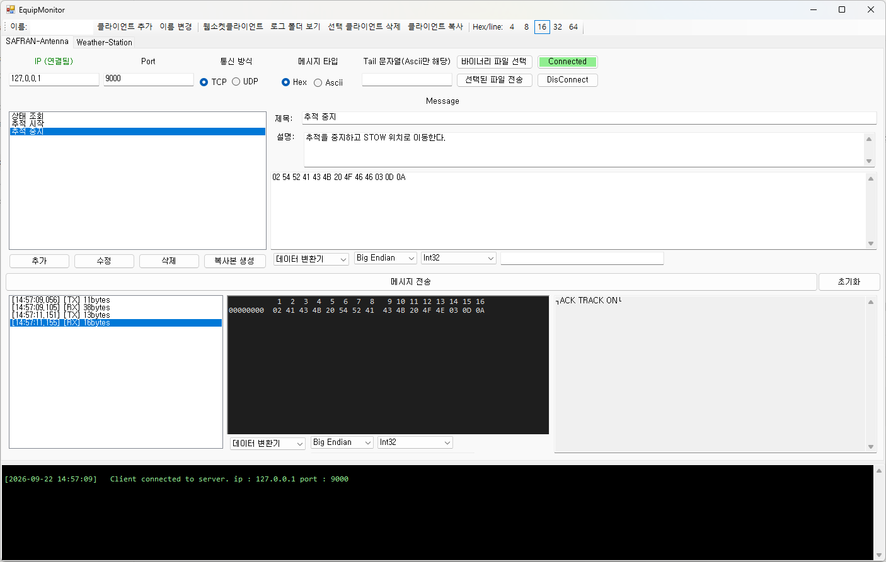
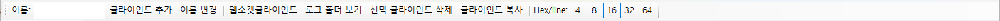
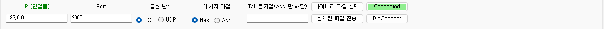
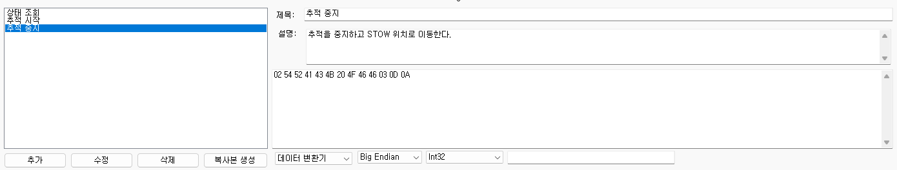
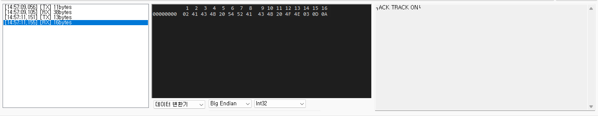
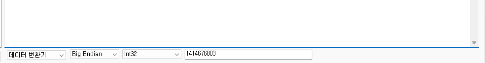
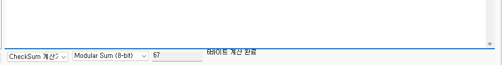
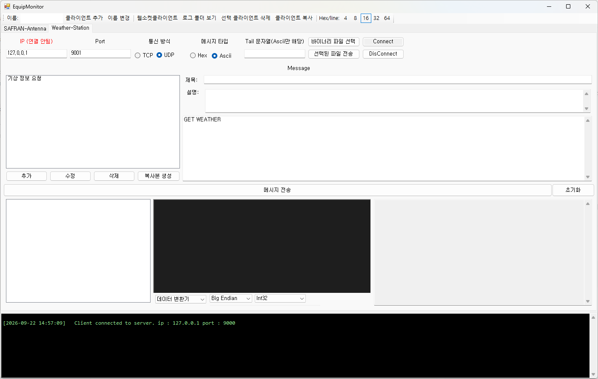

# EquipMonitor

TCP / UDP 장비와 주고받는 패킷을 직접 만들어 보내고, 수신 패킷을 Hex 로 뜯어보는 Windows 데스크톱 도구입니다.
장비별로 탭을 만들어 접속 정보와 커맨드 목록을 저장해 두고, 현장에서 반복적으로 쓰는 요청을 바로 재사용할 수 있습니다.



## 주요 기능

| 기능 | 설명 |
| --- | --- |
| 다중 클라이언트 | 장비마다 탭 하나. 탭별로 IP/Port/커맨드 목록이 파일로 저장됩니다 |
| TCP / UDP | TCP 는 DotNetty 기반 연결 유지 방식, UDP 는 전송할 때마다 송수신 |
| Hex / ASCII 전송 | Hex 문자열 또는 ASCII 문자열로 전송. ASCII 는 Tail 문자열 자동 추가 |
| 커맨드 관리 | 제목·설명·내용을 묶어 저장, 더블클릭으로 즉시 전송 |
| 패킷 뷰어 | TX/RX 패킷 목록 + 오프셋이 붙은 Hex 뷰 + ASCII 뷰 |
| Hex 도구 | 선택한 바이트를 정수/실수로 변환, 체크섬 계산 |
| 바이너리 파일 전송 | 파일을 그대로 바이트 스트림으로 전송 |
| 로그 저장 | 송수신 패킷을 장비별 텍스트 파일로 자동 기록 |
| 웹소켓 클라이언트 | 별도 창에서 WebSocket 접속 및 텍스트 메시지 송수신 |

## 요구 사항

- Windows (Windows 10 / 11 에서 확인)
- .NET Framework 4.7.2
- 빌드 시 Visual Studio 2019 이상 또는 MSBuild

## 빌드

```powershell
# NuGet 패키지 복원 후 빌드
msbuild EquipMonitor.sln /t:Restore,Build /p:Configuration=Release
```

Visual Studio 에서는 `EquipMonitor.sln` 을 열고 그대로 빌드하면 됩니다.
결과물은 `EquipMonitor\bin\Release\EquipMonitor.exe` 입니다.

## 실행

`EquipMonitor.exe` 를 실행하면 메인 창과 함께 콘솔 창이 하나 더 뜹니다.
콘솔 창에는 예외 로그가 출력되므로 닫지 말고 두는 것을 권장합니다.

실행 파일과 같은 폴더에 다음 폴더/파일이 자동으로 생성됩니다.

```
EquipMonitor.exe
Equipment\              # 장비별 설정 (탭 하나당 파일 하나)
Log\                    # 송수신 로그, 예외 로그
layout_settings.json    # 창 크기 및 분할선 위치
```

---

# 사용자 설명서

## 1. 화면 구성

창은 위에서부터 **툴바 → 클라이언트 탭 → 콘솔 로그** 순으로 구성됩니다.
클라이언트 탭 안은 다시 **접속 설정 / 커맨드 관리 / 패킷 뷰어** 세 부분으로 나뉩니다.
가운데 분할선을 드래그해 커맨드 영역과 패킷 영역의 비율을 조절할 수 있고, 이 위치는 장비별로 기억됩니다.

## 2. 툴바 — 클라이언트 관리



| 항목 | 동작 |
| --- | --- |
| 이름 | 추가하거나 이름을 바꿀 때 사용할 이름을 입력합니다 |
| 클라이언트 추가 | 입력한 이름으로 새 탭을 만듭니다. 비워 두면 번호가 자동으로 붙습니다 |
| 이름 변경 | 선택된 탭의 이름과 설정 파일 이름을 함께 바꿉니다 |
| 웹소켓클라이언트 | WebSocket 클라이언트 창을 엽니다 |
| 로그 폴더 보기 | 탐색기로 `Log` 폴더를 엽니다 |
| 선택 클라이언트 삭제 | 확인 후 탭과 설정 파일을 모두 지웁니다 |
| 클라이언트 복사 | 현재 탭을 `이름(1)` 형태로 복제합니다 |
| Hex/line | 패킷 뷰어의 한 줄당 바이트 수를 4 / 8 / 16 / 32 / 64 중에서 고릅니다 |

> 삭제는 설정 파일까지 지우고 되돌릴 수 없습니다. 실수로 지웠다면 `Log` 폴더의 기록을 참고해 다시 만들어야 합니다.

## 3. 접속 설정



| 항목 | 설명 |
| --- | --- |
| IP / Port | 접속할 장비의 주소입니다. 라벨에 **(연결됨) / (연결 안됨)** 상태가 색으로 표시됩니다 |
| 통신 방식 | TCP 또는 UDP |
| 메시지 타입 | **Hex** 는 `02 53 54 ...` 처럼 16진수 문자열로, **Ascii** 는 입력한 문자 그대로 전송합니다 |
| Tail 문자열 | ASCII 전송 시 메시지 끝에 붙일 문자열입니다. `\r`, `\n` 을 그대로 적으면 CR, LF 로 변환됩니다. Hex 모드에서는 사용되지 않습니다 |
| Connect / DisConnect | TCP 연결을 맺고 끊습니다. 연결되면 버튼이 초록색 `Connected` 로 바뀝니다 |
| 바이너리 파일 선택 / 선택된 파일 전송 | 파일을 읽어 그 바이트를 그대로 전송합니다 |

TCP 는 **연결을 유지**합니다. `Connect` 로 미리 연결해 두면 이후 전송은 같은 연결을 재사용하고, 연결 없이 바로 전송해도 자동으로 연결합니다.
UDP 는 연결 개념이 없으므로 `Connect` 는 동작하지 않고, 전송할 때마다 소켓을 새로 만들어 보낸 뒤 응답을 최대 3초까지 기다립니다. 시간이 지나면 콘솔 로그에 응답 시간 초과가 표시됩니다.

## 4. 커맨드 관리



왼쪽은 저장된 커맨드 목록, 오른쪽은 편집 영역입니다.

1. **제목**, **설명**, **메시지 내용**을 입력합니다.
2. `추가` 를 누르면 목록에 저장됩니다. 제목이 있으면 제목이, 없으면 내용 앞부분이 목록에 표시됩니다.
3. 목록에서 항목을 고르면 편집 영역에 내용이 채워집니다. 고친 뒤 `수정` 을 누르면 반영됩니다.
4. `복사본 생성` 은 `제목(1)` 형태로 같은 내용을 하나 더 만듭니다.
5. `삭제` 는 선택한 커맨드를 목록에서 지웁니다.

목록의 항목을 **더블클릭하면 그 커맨드가 바로 전송**됩니다. 자주 쓰는 요청은 이 방식이 가장 빠릅니다.

커맨드를 추가·수정·삭제하면 `Equipment\<장비이름>.txt` 에 즉시 저장되므로 프로그램을 다시 켜도 그대로 남아 있습니다.

## 5. 메시지 전송

`메시지 전송` 버튼을 누르면 편집 영역의 내용이 전송됩니다.

- **Hex 모드**: 공백을 무시하고 두 자리씩 끊어 바이트로 변환합니다. `02 53 54` 와 `025354` 는 같습니다.
- **ASCII 모드**: 입력한 문자를 UTF-8 로 변환해 전송하고, Tail 문자열이 있으면 끝에 붙입니다.
  UDP 는 여러 줄을 입력하면 줄 단위로 나눠 각각 전송하고, TCP 는 입력 전체를 한 번에 전송합니다.

전송이나 연결에 실패하면 창 아래쪽 검은 콘솔 로그 영역에 오류 메시지가 표시됩니다.

## 6. 패킷 뷰어



왼쪽 목록에는 주고받은 패킷이 시간 순으로 쌓입니다. `[TX]` 는 보낸 것, `[RX]` 는 받은 것이며 바이트 수가 함께 표시됩니다.

목록에서 패킷을 고르면

- 가운데: **Hex 뷰** — 맨 앞 8자리는 오프셋, 윗줄은 열 번호입니다. 툴바의 `Hex/line` 으로 한 줄 길이를 바꿀 수 있습니다.
- 오른쪽: **ASCII 뷰** — 같은 데이터를 UTF-8 문자열로 표시합니다.

`초기화` 버튼을 누르면 패킷 목록과 두 뷰가 모두 비워집니다. 이미 저장된 로그 파일은 지워지지 않습니다.

## 7. Hex 도구

패킷 뷰어 아래와 메시지 입력창 아래에 각각 Hex 도구가 붙어 있습니다. 왼쪽 콤보에서 **데이터 변환기** 와 **CheckSum 계산기** 를 전환합니다.

### 데이터 변환기



Hex 문자열에서 바이트를 **드래그로 선택하면** 그 값이 지정한 타입으로 해석되어 표시됩니다.
위 예시는 `52 41 43 4B` 를 Big Endian Int32 로 읽어 `1414676803` 을 보여주고 있습니다.

- 엔디안: Big Endian / Little Endian
- 타입: 2진수(8비트), Int8 ~ Int64, UInt8 ~ UInt64, Single(float32), Double(float64)

반대로 값 칸에 숫자를 입력하면 선택한 위치의 Hex 가 그 값으로 바뀝니다. 커맨드의 특정 필드만 고쳐 보낼 때 유용합니다.
패킷 뷰어 쪽 Hex 뷰는 읽기 전용이라 이 역방향 편집은 메시지 입력창 아래의 변환기에서만 동작합니다.

### CheckSum 계산기



체크섬을 계산할 범위를 드래그로 선택하면 결과가 즉시 표시됩니다. 오른쪽에 계산에 사용된 바이트 수가 함께 나옵니다.

- Modular Sum (8-bit)
- XOR (LRC)

## 8. UDP / ASCII 장비



통신 방식을 **UDP**, 메시지 타입을 **Ascii** 로 두면 문자 기반 장비용 화면이 됩니다.
ASCII 모드에서는 Hex 도구가 숨겨지고, Tail 문자열 칸이 의미를 갖습니다. 줄 끝에 CR/LF 가 필요한 장비라면 Tail 에 `\r\n` 을 넣어 두세요.

## 9. 웹소켓 클라이언트

툴바의 `웹소켓클라이언트` 를 누르면 별도 창이 열립니다. 구성은 단순합니다.

1. 맨 위 **URL** 칸에 `ws://호스트:포트/경로` 를 입력합니다.
2. `접속` 버튼으로 연결합니다. 연결되면 버튼이 `접속 해제` 로 바뀌고 로그에 접속 메시지가 남습니다.
3. 아래쪽 입력칸에 보낼 텍스트를 적고 `전송` 을 누르거나 Enter 를 칩니다.
4. 가운데 로그 영역에 `[송신]`, `[수신]` 이 시간과 함께 기록되고, 같은 내용이 `Log\Websocket <시각>.txt` 로 저장됩니다.

URL 은 `Equipment\websocket.json` 에 저장되어 다음에 창을 열면 자동으로 채워집니다.
연결에 실패하면 `연결 오류: ...` 메시지가 로그에 표시됩니다.

## 10. 로그

- `Log\<시각>_<장비이름>.txt` — 장비별 송수신 기록. 각 패킷을 `[TX]`/`[RX]` 로 구분해 HEX 와 ASCII 두 줄로 남깁니다. 파일은 연결(또는 UDP 전송)할 때마다 새로 만들어집니다.
- `Log\Websocket <시각>.txt` — 웹소켓 송수신 기록
- `Log\crash_log.txt` — 처리되지 않은 예외. 프로그램이 이상하게 동작하면 이 파일을 먼저 확인하세요.

툴바의 `로그 폴더 보기` 로 바로 열 수 있습니다.

---

## 저장 파일 형식

### `Equipment\<장비이름>.txt`

탭 하나가 파일 하나입니다. 내용은 JSON 이며 직접 편집하거나 다른 PC 로 복사해 쓸 수 있습니다.

```json
{
  "name": "SAFRAN-Antenna",
  "ip": "127.0.0.1",
  "port": 9000,
  "clientType": "TCP",
  "isHex": true,
  "command": "02 53 54 41 54 55 53 3F 03 0D 0A",
  "commands": [
    {
      "Title": "상태 조회",
      "Description": "안테나의 현재 상태(방위각/고각)를 요청한다.",
      "Content": "02 53 54 41 54 55 53 3F 03 0D 0A"
    }
  ],
  "tail": ""
}
```

- `name` 은 파일 이름으로 덮어써지므로, 이름을 바꾸려면 파일 이름을 바꾸거나 툴바의 `이름 변경` 을 쓰세요.
- `clientType` 은 `TCP` 또는 `UDP` 입니다.
- 파일이 깨져 있으면 기본값으로 열리고 프로그램은 그대로 동작합니다.

### `layout_settings.json`

창 크기와 상태, 장비별 분할선 위치를 저장합니다. 지우면 기본 레이아웃으로 돌아갑니다.

---

## 부록: HTTP API 테스터

`http` 폴더에는 장비 연동과 별개로 REST API 를 시험할 수 있는 간단한 도구가 들어 있습니다.

```
http\
  api_tester.html   # 브라우저에서 여는 API 테스터 화면
  proxy.ps1         # CORS 우회용 로컬 프록시 (PowerShell)
  proxy.js          # 같은 기능의 Node.js 버전
  start.bat         # 프록시를 띄우고 테스터를 여는 실행 파일
```

`start.bat` 을 실행하면 `localhost:3000` 에 프록시가 뜨고 브라우저에서 테스터가 열립니다.
메서드·URL·쿼리 파라미터·헤더·바디·인증(Bearer, Basic)을 지정해 요청을 보내고, 응답 본문과 헤더, 상태 코드, 소요 시간, 크기를 확인할 수 있습니다. 요청 이력은 브라우저에 남으며 내보내기도 지원합니다.

프록시는 요청을 `x-target-url` 헤더로 받아 그대로 중계하는 방식이라, 브라우저에서 바로 호출하면 CORS 로 막히는 서버도 테스트할 수 있습니다.

---

## 프로젝트 구조

```
EquipMonitor\
  MainForm.cs                 # 메인 창, 탭·툴바 관리
  Equipment.cs                # 클라이언트 탭 하나에 해당하는 UserControl
  TcpEquipmentClient.cs       # DotNetty 기반 TCP 송수신
  UdpEquipmentClient.cs       # UDP 송수신
  ClientHandler.cs            # TCP 수신 핸들러 (수신 패킷을 목록에 추가)
  WebsocketClientForm.cs      # WebSocket 클라이언트 창
  HexRichTextBox.cs           # 오프셋이 붙은 Hex 뷰 컨트롤
  LayoutSettingsManager.cs    # 창 크기·분할선 위치 저장
  Hex\
    HexUtil.cs                # 데이터 변환기 / 체크섬 계산기 전환
    DataConverter.cs          # 선택 바이트 <-> 값 변환
    CheckSumCalculator.cs     # Modular Sum, XOR(LRC)
  dto\
    EquipmentInfo.cs          # 저장되는 장비 설정
    EquipmentDto.cs           # 실행 중 상태와 로그 기록
    CommandInfo.cs            # 커맨드(제목/설명/내용)
    PacketInfo.cs             # 송수신 패킷 한 건
```

## 문제 해결

| 증상 | 확인할 것 |
| --- | --- |
| 연결이 되지 않음 | IP/Port, 방화벽, 장비가 TCP 연결을 받는 상태인지 확인 |
| 보냈는데 응답이 없음 | 메시지 타입(Hex/Ascii)과 Tail 문자열이 장비 규격과 맞는지 확인 |
| 프로그램이 갑자기 종료됨 | `Log\crash_log.txt` 와 콘솔 창 출력을 확인 |
| 설정이 사라짐 | `Equipment` 폴더에 해당 이름의 `.txt` 파일이 있는지 확인 |
